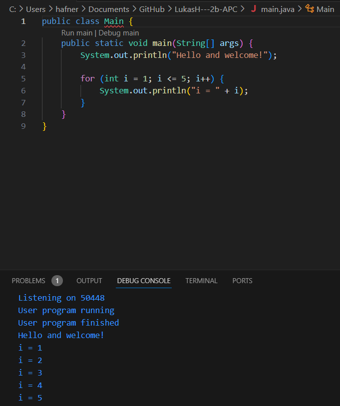

# LukasH---2b-APC
# Projektname

**Erste JAVA Übung**

## Beschreibung der Software

Dieses Projekt ist eine einfache JAVA-Anwendung, die im Rahmen einer Übung entwickelt wurde. Die Software demonstriert grundlegende Konzepte der JAVA-Programmierung und dient als Einstieg in die Entwicklung von JAVA-Anwendungen.

## Beschreibung der Installation

Um dieses Projekt lokal zu installieren und auszuführen, folge diesen Schritten:
1. **Klonen des Repositories**:
   ```bash
   git clone https://github.com/LukasH666/LukasH---2b-APC.git
---------------------------------------------------------------------------------------
2. Öffnen des Projekts in einer IDE:

- Öffne das geklonte Projekt in einer JAVA-fähigen IDE wie IntelliJ IDEA oder Visual Studio Code.
---------------------------------------------------------------------------------------
3. Ausführen des Projekts:

- Navigiere zur Hauptklasse (Main.java oder ähnlich) und führe die Anwendung aus.
---------------------------------------------------------------------------------------
## Verwendete Technologien

JAVA: Die Programmiersprache, in der die Anwendung geschrieben ist.

Git: Versionskontrolle.

GitHub: Respository

## Mögliche Verwendungen (API)

1. Java Standard Library APIs:

-java.net: Für Netzwerkoperationen (z. B. HTTP-Anfragen).

-java.sql: Für Datenbankzugriffe.

-java.util.stream: Für die Verarbeitung von Datenströmen (Streams).

2. Externe APIs:

-REST-APIs:

-Twitter API: Für die Integration von Twitter-Funktionen.

-OpenWeatherMap API: Für Wetterdaten.

-Google Maps API: Für Standort- und Kartendienste.

3. WebSocket APIs:

-Für Echtzeit-Kommunikation zwischen Client und Server.

4. Cloud-APIs:

-AWS SDK for Java: Für die Integration von Amazon Web Services.

-Google Cloud API: Für die Nutzung von Google Cloud-Diensten.

5. Payment-APIs:

-PayPal API: Für die Integration von Zahlungsfunktionen.

-Stripe API: Für die Abwicklung von Online-Zahlungen.

6. Social Media APIs:

-Facebook Graph API: Für die Integration von Facebook-Funktionen.

-Instagram API: Für den Zugriff auf Instagram-Daten.

7. Machine Learning APIs:

-TensorFlow Java API: Für Machine-Learning-Modelle.

-Weka: Eine Java-Bibliothek für Data Mining.

---------------------------------------------------------------------------
## Screenshots

Hier ein Screenshot meiner Anwendung:



----------------------------------------------------------------------------
## Lizenz

[MIT](https://choosealicense.com/licenses/mit/)

